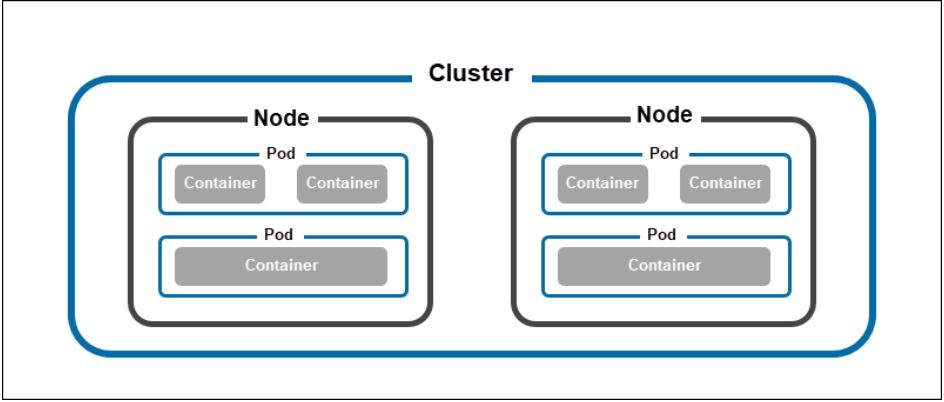
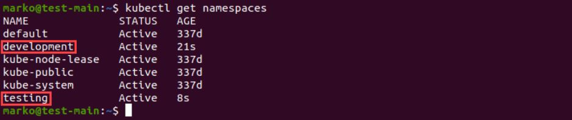

# k8s Objects :-
## What are Kubernetes Objects?
### Kubernetes objects are entities in a Kubernetes cluster that serve as a record of intent. Administrators create objects to express the cluster's desired state, and Kubernetes uses them to maintain this state automatically.

## There are five types of objects model :
1. Namespaces 
1. Pods 
1. Replicaset
1. Deployement 
1. Services

## Namespaces :
   The purpose of the Namespace object is to act as a separator of resources in the cluster. A single cluster can contain multiple namespaces, allowing administrators to organize the cluster better and simplify resource allocation.

A new cluster comes with multiple namespaces created for system purposes and the default namespace for users. Administrators can create any number of additional namespaces - for example, one for development and one for testing.
 ### To check the namespaces : 
       kubectl get namespace

## Pods :
Pods are the smallest unit of deployment in Kubernetes. They reside on cluster nodes and have their IP addresses, enabling them to communicate with the rest of the cluster. A single pod can host one or more containers, providing storage and networking resources.
### To check the Pods :
       kubectl get rs

## Replicasets:
ReplicaSets serve the same purpose as ReplicationControllers, i.e. maintaining the same number of pod replicas on the cluster. However, the difference between these two objects is the type of selectors they support. While ReplicationControllers accept only equality-based selectors, ReplicaSets additionally support set-based selectors.

## Deployements :
Deployments are controller objects that provide instructions on how Kubernetes should manage the pods hosting a containerized application. Using deployments, administrators can:

Scale the number of pod replicas.
Rollout updated code.
Perform rollbacks to older code versions.

Once created, the deployment controller monitors the health of the pods and nodes. In case of a failure, it destroys the failed pods and creates new ones. It can also bypass the malfunctioning nodes, enabling the application to remain functional even when a hardware error occurs.

## Services :
Services provide a way to expose applications running in pods. Their purpose is to represent a set of pods that perform the same function and set the policy for accessing those pods.

Although pod failure is an expected event in a cluster, Kubernetes replaces the failed pod with a replica with a different IP address. This creates problems in communication between pods that depend on each other.

Using the kube-proxy process that runs on each cluster node, Kubernetes maps the service's virtual IP address to pod IP addresses. This process allows for easier internal networking but also enables exposing of the deployment to external networks via techniques such as load balancing.

### Pods :
 

 

 ### Namespaces:
 